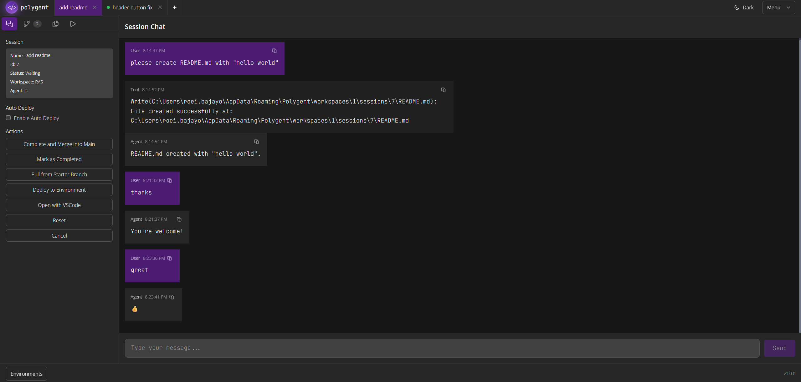
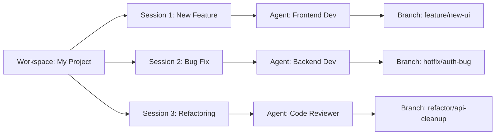

<div align="center">
  
    
  ## **AI Agent Orchestration Platform**

beta

[](https://dotnet.microsoft.com/)
[](https://reactjs.org/)
[](./LICENSE)
[](https://github.com/roeibajayo/Polygent/releases)

[🚀 Quick Start](#-quick-start) • [🔄 How It Works](#-how-does-it-work) • [🤝 Contributing](#-contributing)

</div>

---

<div align="center">
  
</div>

## 🎯 Overview

**Polygent** is a powerful platform for orchestrating AI agents with centralized control and monitoring. Built for developers who need to scale intelligent applications efficiently, Polygent simplifies the complexity of managing multiple AI agents while providing enterprise-level security, isolation, and monitoring capabilities.

### 🌟 Why Polygent?

- **🔒 Privacy-First**: Runs entirely on your infrastructure - your data never leaves your environment
- **⚡ Developer Experience**: Streamlined workflows for AI agent development and deployment
- **🎛️ Centralized Control**: Unified management interface for all your AI agents and workspaces
- **🔄 GitOps Integration**: Seamless Git workflow integration with branch management and PR experience

---

## 🚀 Quick Start

### Prerequisites

Before installing Polygent, ensure you have:

- **[.NET 9 Runtime](https://dotnet.microsoft.com/en-us/download/dotnet/thank-you/runtime-desktop-9.0.8-windows-x64-installer)**
- **[Git](https://git-scm.com/downloads/win)**
- **[Claude Code](https://www.anthropic.com/claude-code)**

### Windows Installer (Recommended)

Download and run the official installer:

[PolygentInstaller.msi](https://github.com/roeibajayo/polygent/raw/refs/heads/main/installer/PolygentInstaller.msi)

### Option 2: Build from Source (For Mac Users or Developers)

```bash
# Clone the repository
git clone https://github.com/roeibajayo/Polygent.git
```

---

## 🔄 How Does It Work?

Polygent streamlines AI agent development through a structured workflow that ensures isolation, version control, and seamless collaboration. Here's how the development process works:

### 1. **🏗️ Create Workspace**

Start by setting up your project workspace:

- **Git Repository Integration**: Connect to your existing Git repository or create a new one
- **Branch Configuration**: Specify the main branch (usually `main` or `develop`)
- **Project Structure**: Polygent clones the repository and sets up the workspace structure
- **Environment Variables**: Configure workspace-level environment variables

```bash
# Example: Creating a workspace
Workspace Name: "My AI Project"
Git Repository: "https://github.com/yourorg/your-project.git"
Main Branch: "main"
```

### 2. **🤖 Configure Agent**

Set up your AI agent for the specific development tasks:

- **Agent Selection**: Choose from supported agents (Claude Code, custom agents)
- **Role Definition**: Define the agent's role (e.g., "Frontend Developer", "Backend Engineer")
- **System Prompt**: Configure agent-specific instructions and context
- **Model Configuration**: Select the appropriate AI model and parameters

```bash
# Example: Agent configuration
Agent Name: "Frontend Assistant"
Role: "React TypeScript Developer"
Model: "Claude Code"
System Prompt: "You are an expert React TypeScript developer..."
```

### 3. **🚀 Start Development Session**

Launch an isolated development environment:

- **Session Creation**: Each session gets its own Git worktree and branch
- **Branch Isolation**: Automatic branch creation from the main branch
- **Workspace Isolation**: Dedicated file system space for the session
- **Real-time Sync**: File changes are monitored and synced in real-time

```bash
# Polygent automatically creates:
Session Branch: "feature/session-123-new-feature"
Worktree Path: "/workspaces/1/sessions/123/"
Isolation: Complete file system and Git isolation
```

### 4. **💻 AI Agent Development**

Collaborate with your AI agent in real-time:

- **Interactive Chat**: Direct communication with the agent through the web interface
- **Code Generation**: Agent writes, modifies, and reviews code
- **File Management**: Create, edit, and organize project files
- **Git Operations**: Stage, commit, and manage version control operations
- **Task Execution**: Run scripts, tests, and build processes

### 5. **🧪 Test & Deploy**

Validate your changes before merging:

- **Environment Deployment**: Deploy to development/staging environments
- **Hot Reload**: Real-time testing with instant updates
- **Task Automation**: Run automated tests, linting, and quality checks
- **Preview Mode**: Test changes in isolated environments

### 6. **🔀 Merge & Release**

Complete the development cycle:

- **Code Review**: Review all changes made during the session
- **Branch Merge**: Merge the session branch back to main
- **Cleanup**: Automatic cleanup of temporary resources
- **Release Notes**: Generate documentation of changes

### 🔄 **Parallel Development**

The real power of Polygent comes from running multiple sessions simultaneously:



### 📋 **Backlog Integration**

Streamline project management:

- **Backlog Items**: Create and manage development tasks
- **Direct Session Creation**: Start development sessions directly from backlog items
- **Progress Tracking**: Monitor task completion across sessions
- **Priority Management**: Organize and prioritize development work

### 🌍 **Environment Management**

Manage multiple deployment environments:

- **Development**: Local development with hot reload
- **Custom Environments**: Create environment-specific configurations

---

## ✨ Key Features

### 🎮 **Centralized Agent Management**

- Unified control panel for managing multiple AI agents
- Real-time monitoring and status tracking
- Agent-specific configuration and role management

### 🔄 **Parallel Development Sessions**

- Manage multiple AI development sessions simultaneously
- Each session gets isolated workspace and Git worktree
- Browser-like tab experience for agent development

### 🏗️ **Workspace Isolation**

- Completely isolated development environments
- Dedicated Git branches and working directories
- Environment-specific variable management

### 🚀 **Hot Deployment**

- Deploy changes instantly to live environments
- Real-time hot reload support
- Environment-specific deployment configurations

### 🔧 **Multi-Platform Task Execution**

- Support for PowerShell, Bash, Python, and Node.js scripts
- Real-time output streaming and monitoring
- Task templates and reusable scripts

### 📋 **Advanced Project Management**

- Integrated backlog management
- Task tracking and status management
- Direct session creation from backlog items

### 🔐 **Enterprise Security**

- Role-based access control (RBAC)
- Secure credential management
- Audit logging and compliance features

## 🏢 Enterprise Features

### Coming Soon Enterprise Features

- 🔄 **Unlimited Workspaces** - Scale beyond hobby limits
- 🌍 **Multi-Environment Support** - Dev, test, staging workflows
- 🔌 **MCP Integration** - Model Context Protocol support
- 🔗 **Third-Party Integrations** - GitHub, Azure DevOps, Jira
- 📱 **Mobile Experience** - ngrok integration for mobile development
- 🔔 **Advanced Notifications** - Slack, Teams, Telegram integration
- 🔍 **Search** - Advanced code search capabilities
- 🎨 **Custom Themes** - Brand customization options
- 🚀 **Auto Updates** - Seamless enterprise update management

### Enterprise Licensing

For enterprise licensing and commercial use, contact:
📧 **[roeibajayo@gmail.com](mailto:roeibajayo@gmail.com)**

---

## 🤝 Contributing

We welcome contributions from the community! Whether you're fixing bugs, adding features, or improving documentation, your help makes Polygent better.

### How to Contribute

1. **🍴 Fork the Repository**

   ```bash
   git clone https://github.com/[your-username]/Polygent.git
   ```

2. **🌿 Create a Feature Branch**

   ```bash
   git checkout -b feature/amazing-feature
   ```

3. **✨ Make Your Changes**

   - Follow our [coding standards](./docs/guidelines/GENERAL_GUIDELINES.md)
   - Add tests for new functionality
   - Update documentation as needed

4. **🧪 Test Your Changes**

   ```bash
   # Backend tests
   cd server && dotnet test

   # Frontend tests
   cd client && npm test

   # Integration tests
   npm run test:integration
   ```

5. **📝 Commit and Push**

   ```bash
   git commit -m "feat: add amazing new feature"
   git push origin feature/amazing-feature
   ```

6. **🔄 Create a Pull Request**
   - Use our [PR template](./github/PULL_REQUEST_TEMPLATE.md)
   - Link relevant issues
   - Provide clear description of changes

### Development Guidelines

- 📋 **Issues**: Use our [issue templates](.github/ISSUE_TEMPLATE/) for bug reports and feature requests
- 💬 **Discussions**: Join our [GitHub Discussions](https://github.com/roeibajayo/Polygent/discussions) for questions
- 📖 **Documentation**: Update docs for any user-facing changes
- 🧪 **Testing**: Maintain test coverage above 80%

### Recognition

All contributors will be recognized in our [CONTRIBUTORS.md](./CONTRIBUTORS.md) file and our annual contributor spotlight.

---

## 📜 License

This project is licensed under the **Prosperity Public License 3.0.0**.

### License Summary

- ✅ **Free for Personal Use**: Use, modify, and distribute for non-commercial purposes
- ✅ **Open Source**: Full source code available
- 💼 **Commercial Licensing**: Available for business use
- 🔒 **IP Protection**: Ensures sustainable project development

For commercial licensing inquiries, please contact [roeibajayo@gmail.com](mailto:roeibajayo@gmail.com).

[📄 Full License Text](./LICENSE)

---

## 📞 Support & Community

### Get Help

- 💬 **Community Forum**: [GitHub Discussions](https://github.com/roeibajayo/Polygent/discussions)
- 🐛 **Bug Reports**: [GitHub Issues](https://github.com/roeibajayo/Polygent/issues)
- 💡 **Feature Requests**: [GitHub Issues with feature label](https://github.com/roeibajayo/Polygent/issues/new?template=feature_request.md)

---

<div align="center">

**⭐ If Polygent helps your team build better AI applications, please consider starring this repository! ⭐**

[⭐ Star on GitHub](https://github.com/roeibajayo/Polygent) •
[🍴 Fork Repository](https://github.com/roeibajayo/Polygent/fork) •
[📖 Read Documentation](./docs/) •
[💬 Join Community](https://github.com/roeibajayo/Polygent/discussions)

</div>
